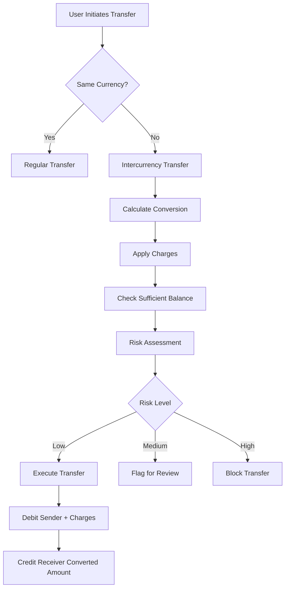

# Intercurrency Exchange Feature

## Overview

The AML system now supports **intercurrency transfers** with automatic currency conversion and real bank-like charges. This feature allows users to transfer money between accounts with different currencies, with automatic exchange rate application and transparent fee calculation.

## Key Features

### 🔄 **Automatic Currency Detection**
- System automatically detects if sender and receiver accounts have different currencies
- Seamlessly handles both same-currency and cross-currency transfers
- No additional user input required - works with existing transfer endpoints

### 💱 **Real-time Currency Conversion**
- Fetches current exchange rates from the database
- Applies conversion automatically during transfer
- Supports multiple currency pairs (USD, EUR, GBP, INR, CAD, AUD, JPY)

### 💰 **Bank-like Charges**
- **Percentage-based charges**: Configurable percentage of transfer amount
- **Fixed charges**: Base fee per transaction
- **Minimum charge**: Ensures minimum fee collection
- **Maximum charge**: Caps the maximum fee (optional)
- **Transparent breakdown**: Detailed charge explanation provided

### 🛡️ **Enhanced Security & Compliance**
- All intercurrency transfers go through the same AML risk assessment
- Suspicious transactions are flagged/blocked as per existing rules
- Enhanced transaction descriptions with conversion details
- Full audit trail maintained

## Database Schema

### CurrencyExchange Entity
```sql
CREATE TABLE currency_exchange (
    id BIGINT PRIMARY KEY AUTO_INCREMENT,
    from_currency VARCHAR(3) NOT NULL,
    to_currency VARCHAR(3) NOT NULL,
    exchange_rate DECIMAL(10,6) NOT NULL,
    base_charge_percentage DECIMAL(5,4) NOT NULL,
    fixed_charge DECIMAL(10,2) NOT NULL,
    minimum_charge DECIMAL(10,2) NOT NULL,
    maximum_charge DECIMAL(10,2),
    is_active BOOLEAN NOT NULL DEFAULT TRUE,
    effective_from DATETIME NOT NULL,
    effective_until DATETIME,
    rate_source VARCHAR(100),
    last_updated_by VARCHAR(100),
    created_at DATETIME NOT NULL,
    updated_at DATETIME
);
```

## API Endpoints

### Customer Endpoints

#### 1. Regular Transfer (Auto-detects Currency Conversion)
```http
POST /api/transactions/transfer
Content-Type: application/json

{
    "fromAccountNumber": "AC-123456",
    "toAccountNumber": "AC-789012",
    "amount": 1000.00,
    "currency": "USD",
    "description": "Payment for services",
    "receiverCountryCode": "GB"
}
```

#### 2. Explicit Intercurrency Transfer
```http
POST /api/transactions/intercurrency-transfer
Content-Type: application/json

{
    "fromAccountNumber": "AC-123456",
    "toAccountNumber": "AC-789012",
    "amount": 1000.00,
    "description": "International payment",
    "receiverCountryCode": "GB"
}
```

#### 3. Currency Conversion Calculator
```http
GET /api/currency/conversion?fromCurrency=USD&toCurrency=EUR&amount=1000
```

#### 4. Check if Conversion Needed
```http
GET /api/currency/conversion-needed?fromAccountNumber=AC-123456&toAccountNumber=AC-789012
```

#### 5. Get Exchange Rate
```http
GET /api/currency/exchange-rate?fromCurrency=USD&toCurrency=EUR
```

#### 6. Get Supported Currencies
```http
GET /api/currency/supported
```

### Admin Endpoints

#### 1. Create/Update Exchange Rate
```http
POST /api/currency/admin/exchange-rate
Authorization: Bearer <admin-token>
Content-Type: application/json

{
    "fromCurrency": "USD",
    "toCurrency": "EUR",
    "exchangeRate": 0.85,
    "baseChargePercentage": 0.025,
    "fixedCharge": 5.00,
    "minimumCharge": 10.00,
    "maximumCharge": 100.00,
    "rateSource": "MANUAL"
}
```

#### 2. Initialize Default Rates
```http
POST /api/currency/admin/initialize-default-rates
Authorization: Bearer <admin-token>
```

#### 3. Deactivate Exchange Rate
```http
DELETE /api/currency/admin/exchange-rate/{id}
Authorization: Bearer <admin-token>
```

## How It Works

### 1. Transfer Flow


### 2. Charge Calculation
```
Total Charge = max(
    min(
        (Amount × Percentage) + Fixed Charge,
        Maximum Charge
    ),
    Minimum Charge
)
```

### 3. Example Transaction
**Scenario**: Transfer $1,000 USD to EUR account
- **Exchange Rate**: 1 USD = 0.85 EUR
- **Base Charge**: 2.5% + $5 fixed
- **Minimum Charge**: $10
- **Maximum Charge**: $100

**Calculation**:
- Converted Amount: $1,000 × 0.85 = €850
- Percentage Charge: $1,000 × 0.025 = $25
- Total Charge: $25 + $5 = $30
- Total Debit: $1,000 + $30 = $1,030 USD
- Credit to Receiver: €850

## Configuration

### Default Currency Pairs Supported
- USD ↔ EUR, GBP, INR, CAD, AUD, JPY
- EUR ↔ USD, GBP, INR, CAD, AUD, JPY
- GBP ↔ USD, EUR, INR, CAD, AUD, JPY
- INR ↔ USD, EUR, GBP, CAD, AUD, JPY
- CAD ↔ USD, EUR, GBP, INR, AUD, JPY
- AUD ↔ USD, EUR, GBP, INR, CAD, JPY
- JPY ↔ USD, EUR, GBP, INR, CAD, AUD

### Default Charge Structure
| Currency Pair | Base Charge | Fixed Charge | Min Charge | Max Charge |
|---------------|-------------|--------------|------------|------------|
| Major (USD/EUR/GBP) | 2.5% | $5 | $10 | $100 |
| Emerging (INR) | 2.0% | $3 | $8 | $75 |
| Regional (CAD/AUD) | 2.25% | $4 | $9 | $85 |
| JPY | 2.0% | ¥300 | ¥500 | ¥5000 |

## Testing

### Sample Test Cases

#### 1. USD to EUR Transfer
```json
{
    "fromAccountNumber": "AC-123456",
    "toAccountNumber": "AC-789012",
    "amount": 1000.00,
    "description": "Test intercurrency transfer"
}
```

#### 2. High Amount Transfer (Test Max Charge)
```json
{
    "fromAccountNumber": "AC-123456",
    "toAccountNumber": "AC-789012",
    "amount": 10000.00,
    "description": "Large transfer test"
}
```

#### 3. Small Amount Transfer (Test Min Charge)
```json
{
    "fromAccountNumber": "AC-123456",
    "toAccountNumber": "AC-789012",
    "amount": 50.00,
    "description": "Small transfer test"
}
```

## Error Handling

### Common Error Scenarios
1. **Unsupported Currency Pair**: Returns 404 with clear message
2. **Insufficient Funds**: Includes charge breakdown in error message
3. **Inactive Exchange Rate**: Returns 404 with rate status
4. **Account Status Issues**: Validates both approval and active status
5. **Invalid Amount**: Validates positive amounts

### Sample Error Response
```json
{
    "timestamp": "2024-01-15T10:30:00Z",
    "status": 400,
    "error": "Bad Request",
    "message": "Insufficient funds. Required: 1030.00 USD (Amount: 1000.00 + Charges: 30.00), Available: 500.00 USD",
    "path": "/api/transactions/intercurrency-transfer"
}
```

## Security Considerations

### 1. Rate Management
- Only admins can create/update exchange rates
- Rate changes are logged with admin identity
- Historical rates are preserved for audit

### 2. Transaction Security
- All intercurrency transfers go through AML screening
- Enhanced descriptions include conversion details
- Charge transparency prevents hidden fees

### 3. Balance Protection
- Pre-flight balance checks include charges
- Atomic transactions prevent partial transfers
- Detailed error messages for insufficient funds

## Monitoring & Alerts

### Key Metrics to Monitor
1. **Conversion Volume**: Track intercurrency transfer volumes
2. **Charge Revenue**: Monitor fee collection from conversions
3. **Rate Utilization**: Track which currency pairs are most used
4. **Failed Conversions**: Monitor failures due to rates/funds
5. **Risk Flags**: Track AML flags on intercurrency transfers

### Recommended Alerts
- Exchange rate older than 24 hours
- High volume intercurrency transfers
- Repeated conversion failures
- Unusual currency pair usage

## Future Enhancements

### Planned Features
1. **Real-time Rate Feeds**: Integration with external rate providers
2. **Rate Alerts**: Notify users of favorable rates
3. **Conversion History**: Track user's conversion patterns
4. **Bulk Conversions**: Support multiple transfers in one request
5. **Rate Forecasting**: Predict rate movements
6. **Mobile Notifications**: Alert users about rate changes

### Integration Opportunities
1. **External Rate APIs**: XE.com, CurrencyLayer, Fixer.io
2. **Central Bank Feeds**: Official exchange rates
3. **Crypto Integration**: Support for cryptocurrency conversions
4. **Multi-bank Support**: Cross-bank intercurrency transfers

---

## Quick Start Guide

1. **Setup**: System automatically initializes default rates on startup
2. **Test**: Use existing transfer endpoints - conversion happens automatically
3. **Monitor**: Check logs for conversion details and charges
4. **Manage**: Use admin endpoints to update rates as needed

The intercurrency exchange feature is now fully integrated and ready for production use! 🚀
