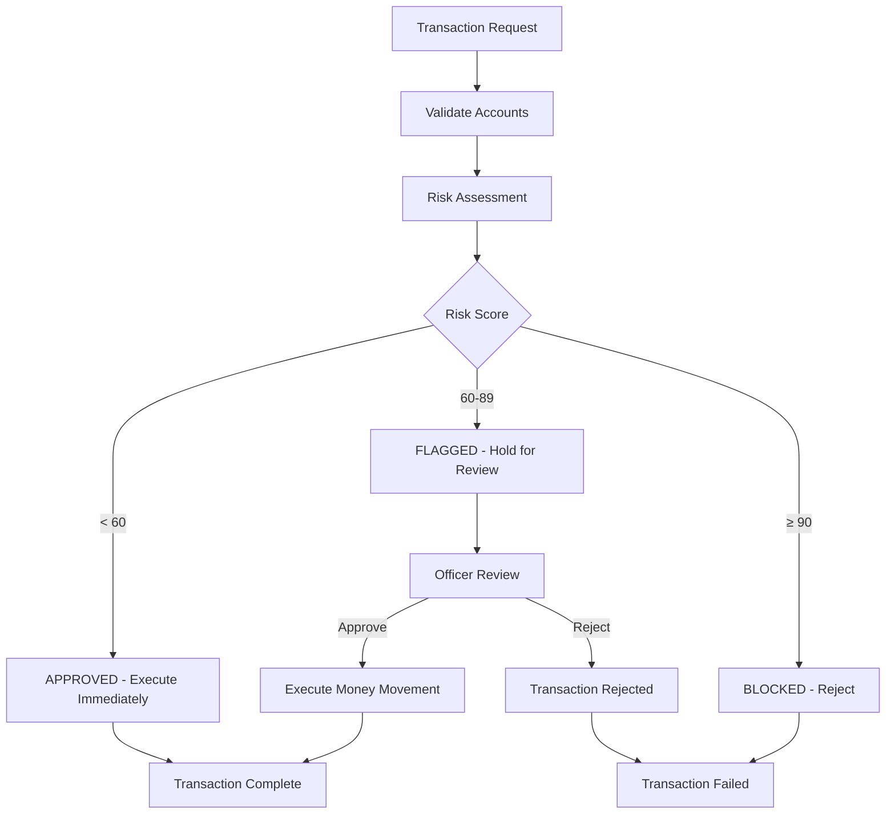

# 🛡️ Proper AML Transaction Flow Implementation

## ✅ **Fixed Transaction Flow**

### **🚨 Previous Problem:**
- ❌ Money was deducted FIRST
- ❌ Risk assessment happened AFTER money movement
- ❌ No way to reverse flagged transactions

### **✅ New Correct Flow:**

```
1. VALIDATE → 2. ASSESS RISK → 3. DECIDE → 4. EXECUTE (if approved)
```

## 🔄 **New Transaction Process**

### **Step 1: Pre-Transaction Validation**
- ✅ Account status check
- ✅ Balance verification
- ✅ Basic validations

### **Step 2: Risk Assessment (NO MONEY MOVEMENT)**
- ✅ NLP/Keyword analysis
- ✅ Rule engine evaluation
- ✅ Country risk assessment
- ✅ Transaction saved with risk score

### **Step 3: Decision Based on Risk Score**
- **APPROVED (< 60)**: Execute money movement immediately
- **FLAGGED (60-89)**: Hold transaction, await manual approval
- **BLOCKED (≥ 90)**: Reject transaction, throw exception

### **Step 4: Money Movement (Only if Approved)**
- ✅ Execute actual balance changes
- ✅ Update account balances
- ✅ Log successful completion

## 📊 **Transaction Status Flow**



## 🎯 **Transaction Scenarios**

### **Scenario 1: APPROVED Transaction**
```json
POST /api/transactions/transfer
{
  "fromAccountNumber": "AC-327026",
  "toAccountNumber": "AC-840075",
  "amount": 2500.00,
  "currency": "USD",
  "description": "Monthly salary payment",
  "receiverCountryCode": "US"
}
```

**Flow:**
1. ✅ Risk assessment: Score = 14
2. ✅ Status: "APPROVED" (< 60)
3. ✅ Money transferred immediately
4. ✅ Transaction complete

### **Scenario 2: FLAGGED Transaction**
```json
POST /api/transactions/transfer
{
  "fromAccountNumber": "AC-327026",
  "toAccountNumber": "AC-840075",
  "amount": 15000.00,
  "currency": "USD",
  "description": "Large business payment for investment",
  "receiverCountryCode": "AO"
}
```

**Flow:**
1. ✅ Risk assessment: Score = 76
2. ⏳ Status: "FLAGGED" (60-89)
3. ⏳ Transaction saved, money NOT moved
4. ⏳ Alert created for officer review
5. 👨‍💼 Officer reviews and approves/rejects

### **Scenario 3: BLOCKED Transaction**
```json
POST /api/transactions/transfer
{
  "fromAccountNumber": "AC-327026",
  "toAccountNumber": "AC-840075",
  "amount": 25000.00,
  "currency": "USD",
  "description": "Large cash payment to shell company for money laundering services",
  "receiverCountryCode": "AF"
}
```

**Flow:**
1. ✅ Risk assessment: Score = 99
2. ❌ Status: "BLOCKED" (≥ 90)
3. ❌ Exception thrown, transaction rejected
4. ❌ No money movement, no transaction saved

## 👨‍💼 **Officer Review Process**

### **Approve Flagged Transaction:**
```java
POST /api/admin/transactions/{transactionId}/approve
{
  "officerEmail": "officer@bank.com"
}
```

**What Happens:**
1. ✅ Transaction status → "APPROVED"
2. ✅ Execute money movement
3. ✅ Alert status → "RESOLVED"
4. ✅ Log officer approval

### **Reject Flagged Transaction:**
```java
POST /api/admin/transactions/{transactionId}/reject
{
  "officerEmail": "officer@bank.com",
  "reason": "Suspicious activity pattern detected"
}
```

**What Happens:**
1. ❌ Transaction status → "REJECTED"
2. ❌ No money movement
3. ✅ Alert status → "RESOLVED"
4. ✅ Log rejection reason

## 🔍 **Console Output Examples**

### **APPROVED Transaction:**
```
Transaction processing - Customer ID: 1, Email: john.doe@example.com
Basic NLP Score: 28, Description: Monthly salary payment
Rule Engine Final Score: 0 (No rules triggered)
Combined Risk Score: 14 (NLP: 28, Rule: 0)
TRANSFER APPROVED: Money transferred successfully.
```

### **FLAGGED Transaction:**
```
Transaction processing - Customer ID: 1, Email: john.doe@example.com
Basic NLP Score: 82, Description: Large business payment for investment
Rule Engine Final Score: 70 (Rule 1 triggered)
Combined Risk Score: 76 (NLP: 82, Rule: 70)
TRANSFER FLAGGED: Transaction saved but money not transferred. Awaiting manual approval.
```

### **BLOCKED Transaction:**
```
Transaction processing - Customer ID: 1, Email: john.doe@example.com
Basic NLP Score: 100, Description: Large cash payment to shell company...
Rule Engine Final Score: 99 (Multiple rules triggered)
Combined Risk Score: 99 (NLP: 100, Rule: 99)
Exception: Transaction blocked due to high risk score: 99
```

## 📋 **Database Changes**

### **Alert Entity Updates:**
```sql
ALTER TABLE alerts ADD COLUMN resolved_by VARCHAR(255);
ALTER TABLE alerts ADD COLUMN resolved_at DATETIME;
UPDATE alerts SET status = 'RESOLVED' WHERE status = 'CLOSED';
```

### **Transaction Status Values:**
- `APPROVED`: Transaction completed successfully
- `FLAGGED`: Awaiting manual review
- `BLOCKED`: Rejected due to high risk
- `REJECTED`: Manually rejected by officer

## 🎯 **Key Benefits**

1. **✅ Compliance**: Proper AML risk assessment before money movement
2. **✅ Security**: High-risk transactions blocked automatically
3. **✅ Control**: Officers can review and approve flagged transactions
4. **✅ Audit Trail**: Complete transaction and approval history
5. **✅ Flexibility**: Different handling for different risk levels
6. **✅ Reversibility**: No money moved until final approval

## 🚀 **Ready for Production**

Your AML system now follows proper compliance procedures:
- ✅ Risk assessment BEFORE money movement
- ✅ Proper handling of flagged transactions
- ✅ Officer approval workflow
- ✅ Complete audit trail
- ✅ Regulatory compliance

Test with different risk scenarios to see the proper flow in action!
